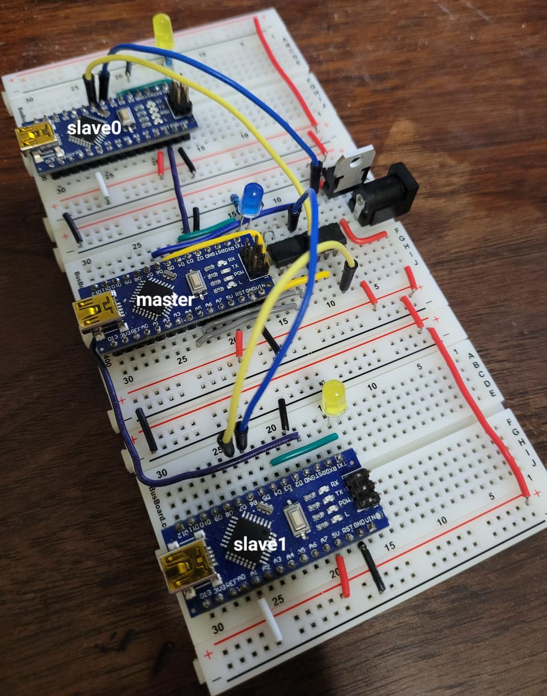

# Serial comms between multiple Arduinos

Master transmits "Hello world" to the selected slave using custom serial GPIO pins. This is then displayed on the (usual) serial monitor of the slave.

* Use `SoftwareSerial` library to designate secondary serial pins TX=5, RX=6
* Use CD4052BE multiplexer to allow selection of up to 4 slave devices
* Slave device selection via pins A4, A5 on the master

Master has the ability to reset all of the slaves by asserting D2 low (could be useful in future).

## Power consideration

* Use external 5V regulator to power multiple Arduinos (the builtin regulator is only intended to power a single device).

## Software
The master and slaves need not run from the same sketch. Right now they do, mode selected by jumper on pin A1, which then runs different code from `loop()` method.

# Test circuit

