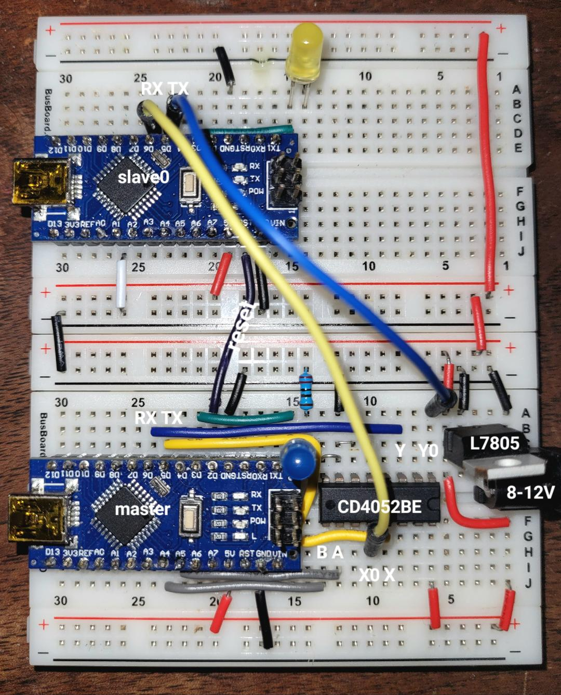

# Serial comms between multiple Arduinos

Master transmits "Hello World" to the selected slave using custom serial GPIO pins. This is then displayed on the (usual) serial monitor of the slave.

Master has the ability to reset all of the slaves by asserting D2 low (could be useful in future).

* Use `SoftwareSerial` library to designate secondary serial pins TX=5, RX=6
* Use CD4052BE multiplexer to allow selection of up to 4 slave devices
* Slave device selection via pins A4, A5 on the master

## Power consideration

* Use external 5V regulator to power multiple Arduinos (the builtin regulator is only intended to power a single device).

## Software
The master and slaves need not run the same code. Right now they do, mode selected by jumper on pin A1.

# Test circuit

